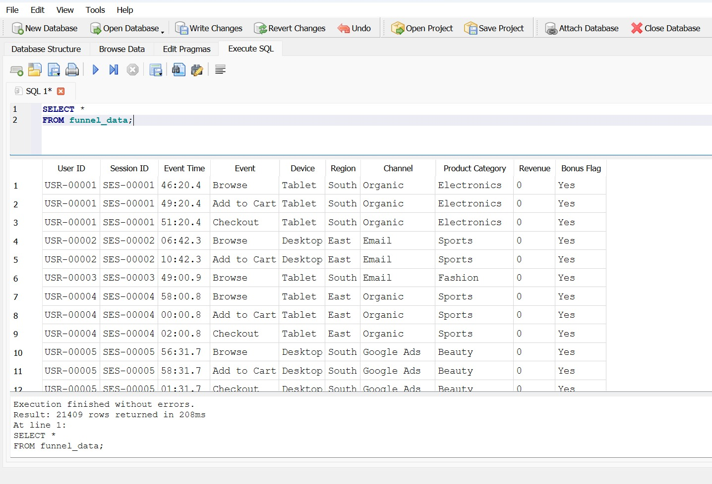
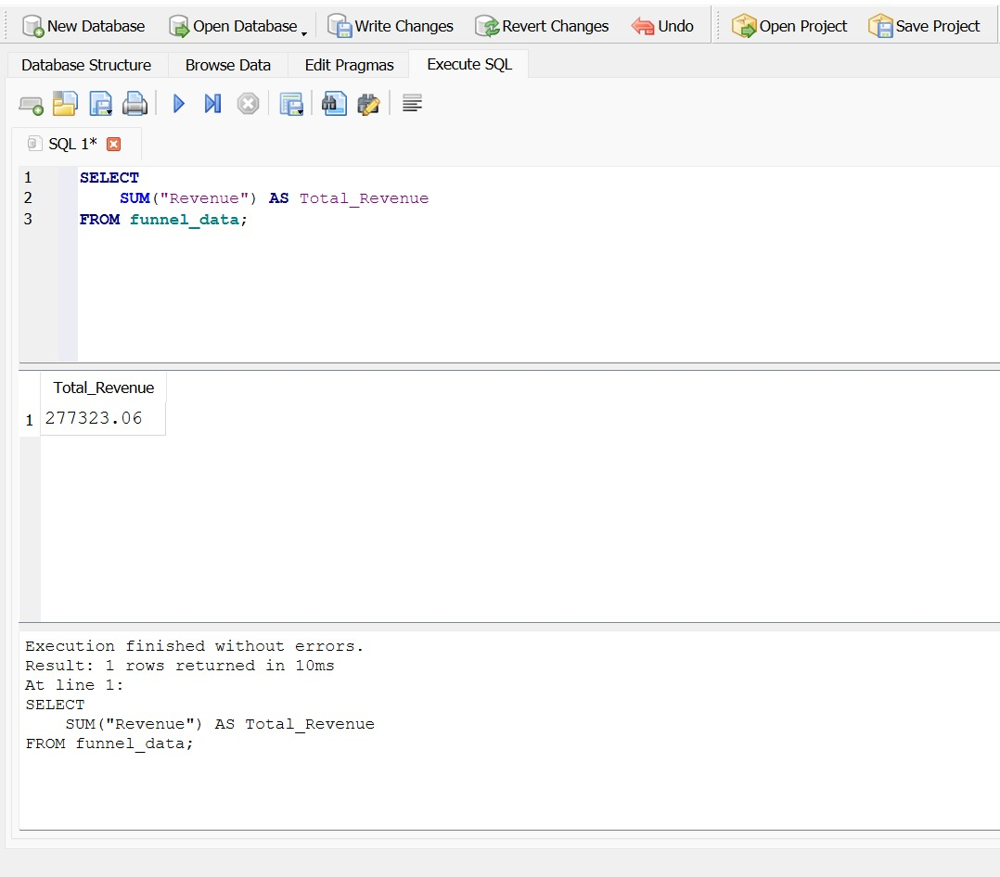
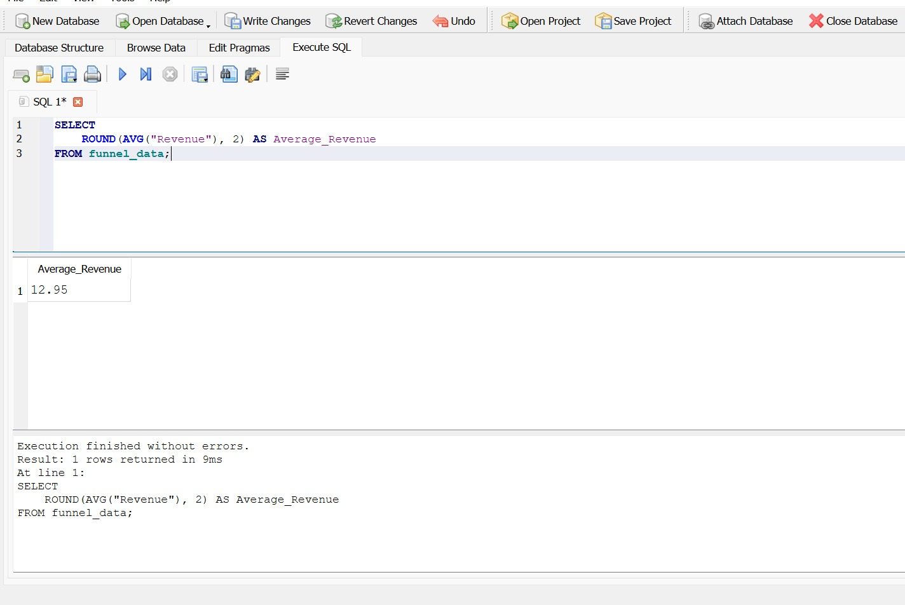
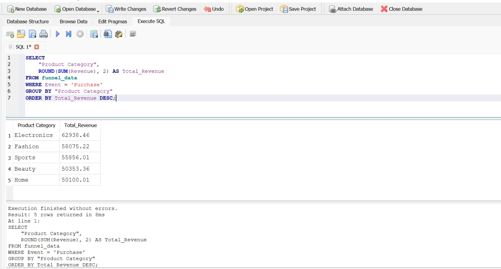
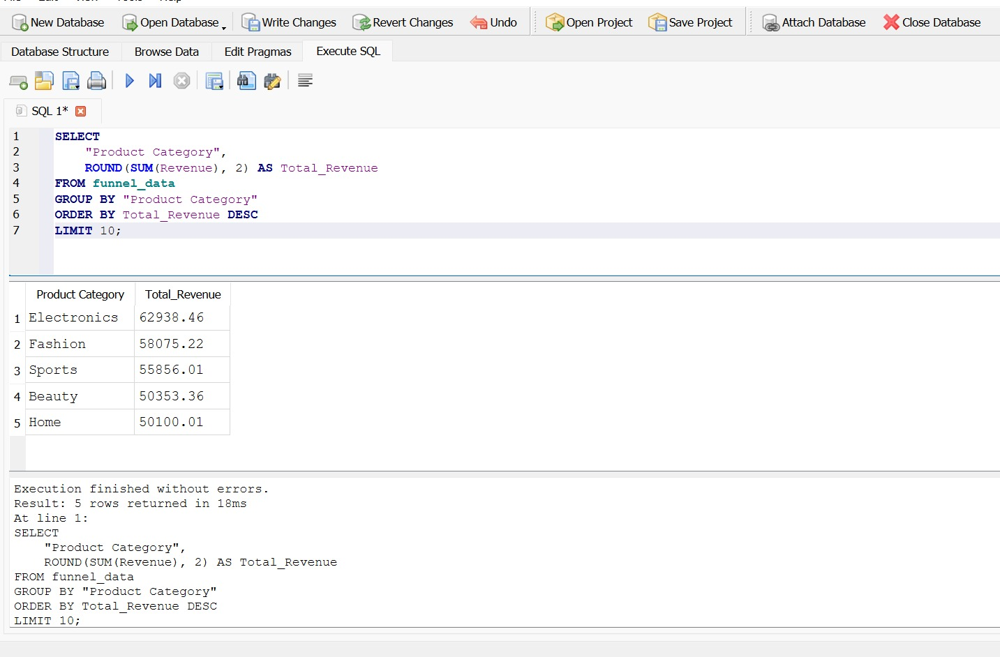
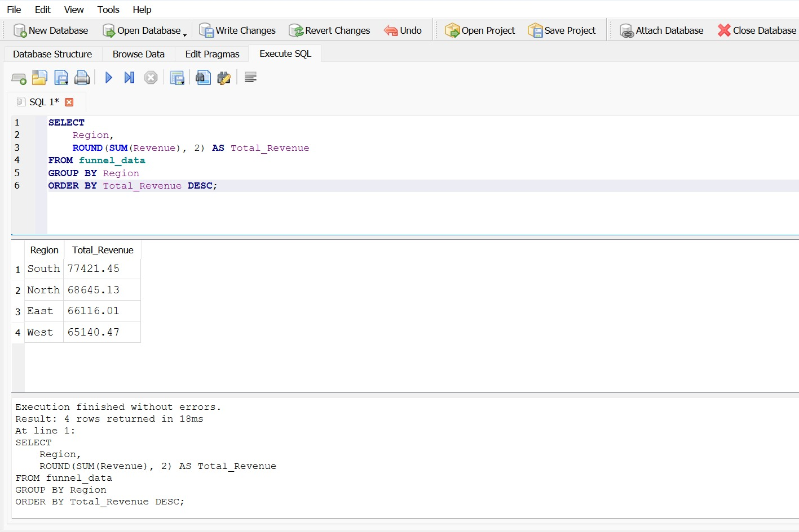
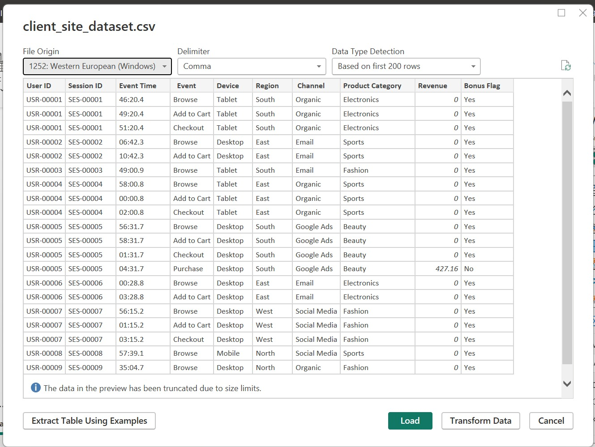
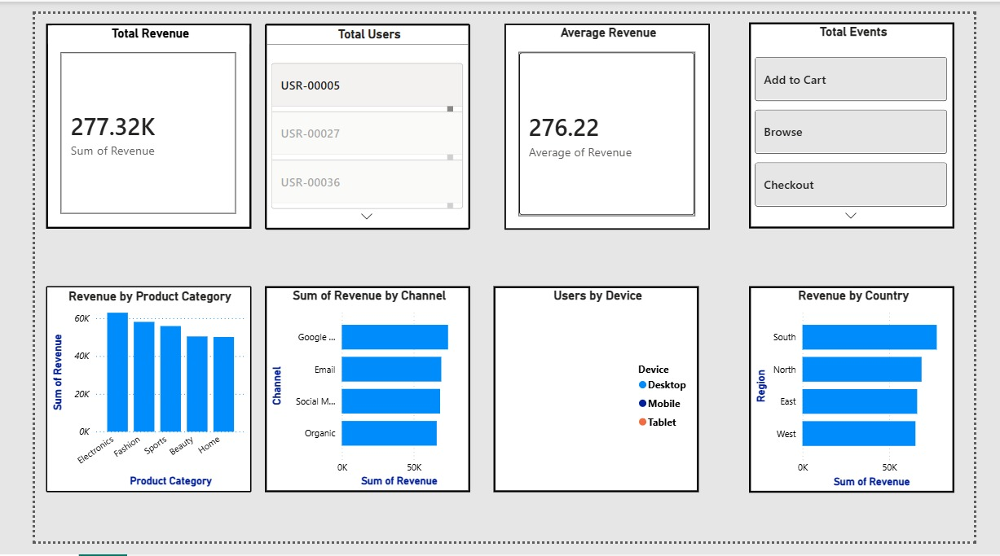
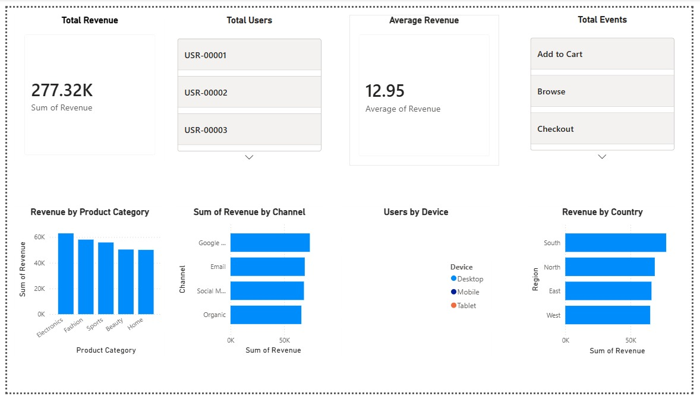

<div align="center">


<br/>


<br/>

[](#)
[](#)
[](#)
[](#)
[](#)
[](#)
[](#)
[](#)
[](#)
[](#)
[](#)

<br/><br/>

[](#)
[](#)
[](#)
[](#)
[](#-license)

</div>

<br/>

---

## 📌 Project Overview

This repository contains my **Final Week (Week 4) Task** for the **Data Analyst Internship at Logic Stack**, focused on **User Funnel & Revenue Performance Analysis** using SQL and Power BI.

The project analyzes a real-world client website dataset to understand how users move through the platform, where they drop off, which marketing channels and devices perform best, and which regions generate the most revenue. The complete workflow — from raw CSV to a business-ready Power BI dashboard — is implemented end to end, closing out the internship on the strongest foundation built across all four weeks.

> 💼 **Internship:** Logic Stack — Data Analysis Internship (23 June – 23 July 2026)

> 🧩 **Task:** Week 4 — Final Project: Funnel Analysis (SQL + Power BI)

> 🛠️ **Tools:** SQLite · DB Browser for SQLite · Power BI Desktop

> 📂 **Dataset:** Client Site Dataset (Funnel & Revenue)

---

## 🎓 Internship Information

| Detail | Description |
|---|---|
| 🏢 **Company** | Logic Stack |
| 👨‍💻 **Role** | Data Analyst Intern |
| 📅 **Internship Duration** | 23 June – 23 July 2026 (1 Month) |
| 🧩 **Task** | Final Week Project — Funnel Analysis |
| ⏱️ **Duration** | 7 Days |
| 📦 **Repository** | week-4-sql-powerbi-funnel-analysis |
| 💻 **Project Type** | SQL Analysis + Power BI Dashboard |
| 🛠️ **Tools** | SQLite, DB Browser for SQLite, Power BI Desktop |
| 📤 **Deliverables** | SQLite Database · SQL Query File · Power BI Dashboard · Business Insights |

---

## 🎯 Project Objective

This project is the final stage of the internship, bringing together everything learned across Excel, Python, and Power BI into a single **SQL-driven analytics workflow**.

The goal is to analyze user behavior on a digital platform using real-world data, in order to:

- ✔ Understand how users progress through the platform funnel
- ✔ Identify the exact stages where users drop off
- ✔ Measure revenue and performance across categories, products, and regions
- ✔ Build an interactive Power BI dashboard for stakeholders
- ✔ Translate raw query outputs into clear business insights and recommendations

---

## 🧩 Business Problem

A digital company wants to understand:

- 🔄 How users move through the platform, from first visit to purchase
- 📉 Where users drop off in the funnel, and at which stage the biggest losses occur
- 📣 Which marketing channels perform best in driving engaged, revenue-generating users
- 📱 Which devices generate higher engagement and conversion
- 🌍 Which regions generate more revenue, to guide expansion and marketing spend

**SQL** was chosen because it allows precise, repeatable querying of structured relational data — aggregating, filtering, and grouping millions of rows efficiently to answer specific business questions. **Power BI** was chosen to turn those query results into an interactive, visual dashboard that non-technical stakeholders can explore on their own, without needing to read raw SQL output.

---

## 🏗️ Project Architecture
```
📄 CSV Dataset
↓
🗄️ SQLite Database
↓
🧮 SQL Queries
↓
📊 Business Analysis
↓
📈 Power BI
↓
🖥️ Dashboard
↓
💡 Insights
↓
✅ Recommendations

```

---

## 🛠️ Technologies Used

<div align="center">

| Technology | Purpose |
|---|---|
|  | Lightweight relational database engine used to store and query the dataset |
|  | Core querying language for aggregation, filtering, and business analysis |
|  | GUI tool used to create, import into, and query the SQLite database |
|  | Interactive dashboard and KPI visualization |
|  | Calculated measures and KPI logic inside Power BI |
|  | Editing SQL scripts and documentation |
|  | Version control and portfolio hosting |
|  | Project documentation |

</div>

---

## 🗂️ Dataset Information

| Field | Detail |
|---|---|
| **Dataset Name** | Client Site Dataset |
| **File Format** | CSV |
| **Database** | funnel_analysis.db (SQLite) |
| **Business Domain** | E-commerce / Digital Platform Funnel |
| **Main Fields** | User ID, Session/Visit Data, Funnel Stage, Device, Marketing Channel, Product, Category, Region, Revenue |

---

## 🗄️ Database Information

The dataset was imported into a **SQLite database** (`funnel_analysis.db`) using **DB Browser for SQLite**.

SQLite was chosen for this project because it is:

- 🪶 **Lightweight** — no server setup required, the entire database lives in a single file
- ⚡ **Fast** — ideal for querying a mid-sized client dataset directly on a local machine
- 🔧 **Simple to manage** — DB Browser for SQLite provides a clean visual interface for importing CSVs, browsing tables, and running SQL directly
- 🔗 **Portable** — the `.db` file can be shared, version-controlled, and opened anywhere

DB Browser for SQLite was used to create the database schema, import the raw CSV, verify data types, and execute all SQL queries used in this analysis.

---

## 🧮 SQL Tasks Performed

A series of structured SQL queries were written to analyze the funnel and revenue data. The analysis included:

- **Data Exploration** — viewing raw table data to understand structure and content
- **SELECT Queries** — retrieving specific columns relevant to the funnel and revenue questions
- **Aggregate Functions** — using `SUM` to calculate total revenue and `AVG` to calculate average order/revenue values
- **GROUP BY Analysis** — grouping data by category, product, and region to compare performance across segments
- **ORDER BY & LIMIT** — ranking results to surface top-performing products, categories, and regions
- **Filtering** — isolating specific funnel stages, devices, or channels for focused analysis
- **Business-Focused Querying** — combining the above techniques to directly answer the client's business questions rather than just producing raw numbers

*(Actual SQL code is available in the `sql/` folder for reference.)*

---

## 📊 Power BI Dashboard

An interactive **Power BI dashboard** was built on top of the SQL query outputs to present the funnel and revenue analysis visually. The dashboard includes:

- 🃏 **KPI Cards** — summarizing key metrics at a glance
- 📈 **Charts** — visualizing revenue by category, top products, and regional performance
- 💡 **Business Insights** — annotated takeaways embedded alongside the visuals
- 🖱️ **Interactive Visuals** — filters and slicers allowing stakeholders to explore the data themselves
- 🎨 **Professional Layout** — clean, consistent color scheme and visual hierarchy

### 🃏 Dashboard KPIs

| KPI | Description |
|---|---|
| 💰 **Total Revenue** | Sum of all revenue generated across the platform |
| 📊 **Average Revenue** | Mean revenue value across transactions |
| 🏆 **Top Category Revenue** | Highest-performing product category by revenue |
| 🌍 **Top Region** | Region generating the highest revenue |

### 📉 Dashboard Visuals

| Visual | Type | Insight |
|---|---|---|
| Revenue by Category | Bar Chart | Which product categories drive the most revenue |
| Top Products | Column Chart | Best-performing individual products |
| Revenue by Region | Map / Bar Chart | Geographic distribution of revenue |
| Total & Average Revenue | KPI Cards | Quick-glance performance summary |

---

## 📁 Repository Folder Structure


```
week-4-sql-powerbi-funnel-analysis/
├─ database/
│ ├─ funnel_analysis.db
│ └─ funnel_analysis.sqbpro
├─ dataset/
│ └─ client_site_dataset.csv
├─ docs/
│ ├─ client_site_dataset (1).csv
│ ├─ README.md
│ └─ Week 4 Task.pdf
├─ powerbi/
│ ├─ Client_Site_Analytics_Dashboard.pbix
│ ├─ final-dashboard0.jpeg
│ ├─ loading-csv-powerbi.png
│ └─ powerbi-dashboard.jpeg
├─ screenshots/
│ ├─ final-dashboard.png
│ ├─ final-dashboard0.jpeg
│ ├─ powerbi-dashboard.jpeg
│ ├─ query-04-purchase-revenue-by-category.png
│ ├─ query-04-top-products.png
│ ├─ query-05-revenue-by-region.png
│ ├─ sql-query-01-view-data.jpeg
│ ├─ sql-query-02-total-revenue.png
│ └─ sql-query-03-average-revenue.jpeg
├─ sql/
│ ├─ funnel_analysis_queries.sql
│ └─ SQL-Command.md
├─ .gitignore
├─ LICENSE
└─ README.md


```
---

## 🖼️ Screenshots

### 🔍 Data Exploration

<div align="center">



*Initial view of the raw client site dataset inside DB Browser for SQLite*

</div>

---

### 💰 Revenue Queries

<div align="center">

| Total Revenue Query | Average Revenue Query |
|:---:|:---:|
|  |  |
| *Aggregate SUM query calculating total platform revenue* | *Aggregate AVG query calculating average revenue value* |

</div>

---

### 📦 Category, Product & Regional Analysis

<div align="center">

| Revenue by Category | Top Products |
|:---:|:---:|
|  |  |
| *Purchase revenue broken down by product category* | *Top-selling products ranked by revenue* |



*Regional breakdown of total revenue generated*

</div>

---

### 📥 Loading Data into Power BI

<div align="center">



*Importing the SQL query output into Power BI for dashboard creation*

</div>

---

### 🖥️ Final Dashboard Views

<div align="center">

| Final Dashboard (View 1) | Final Dashboard (View 2) |
|:---:|:---:|
|  |  |

</div>

---

## 📊 Power BI Dashboard Preview

<div align="center">



*Main Power BI dashboard view — KPIs and core visuals*

<br/>


*Final polished dashboard layout with complete visual set*

</div>

---

## 💡 Key Business Insights

1. 📉 A significant share of users drop off between the initial visit and the purchase stage, indicating a clear opportunity to optimize the mid-funnel experience
2. 💰 A small number of product categories account for a disproportionately large share of total revenue
3. 🏆 A handful of top products consistently outperform the rest of the catalog in revenue contribution
4. 🌍 Revenue is unevenly distributed across regions, with a few regions driving the majority of platform income
5. 📱 Certain devices show noticeably higher engagement and conversion than others
6. 📣 Some marketing channels bring in higher-value, more revenue-generating traffic than others
7. 📊 The average revenue value reveals meaningful variance across transactions, suggesting different customer segments with different spending behavior
8. 🔄 Funnel stage analysis highlights specific points in the user journey where friction is highest, rather than a single uniform drop-off rate

---

## ✅ Business Recommendations

> 🔴 **Recommendation 1:** Focus optimization efforts on the funnel stage with the highest drop-off rate — small improvements there will have an outsized impact on overall conversion.

> 🟡 **Recommendation 2:** Reallocate marketing budget toward the channels and devices shown to drive higher-value, higher-converting traffic.

> 🟢 **Recommendation 3:** Double down on the top-performing product categories and regions with targeted promotions, while investigating why underperforming regions and categories lag behind.

---

## ⚠️ Challenges Faced

Setting up the SQL environment from scratch was the main practical challenge in this project, alongside the usual learning curve of a new tool.

| Challenge | Details |
|---|---|
| 🔴 SQLite Installation | Initial setup and configuration of SQLite took a few attempts to get right |
| 🟡 DB Browser Setup | Getting DB Browser for SQLite installed and configured correctly on Windows |
| 🟡 Database Creation | Structuring the database and defining the correct schema for the imported data |
| 🟠 CSV Import | Ensuring the CSV imported cleanly with correct data types and no formatting issues |
| 🟡 Learning SQL Syntax | Getting comfortable with SQL syntax, especially aggregate and grouping queries |
| 🟢 Resolution | All of the above were minor setup hurdles and were successfully resolved, resulting in a stable, working analysis pipeline |

> 💬 **Takeaway:** These were light, expected setup challenges rather than major blockers — resolving them independently added to the hands-on database experience gained this week.

---

## 📚 Learning Outcomes

| Skill | What I Learned |
|---|---|
| 🗄️ **SQLite** | Setting up and managing a lightweight relational database |
| 🧮 **SQL** | Writing SELECT, aggregate, GROUP BY, ORDER BY, and filtering queries |
| 📊 **Business Analysis** | Translating query results into actionable business insights |
| 📈 **Power BI** | Building KPI cards and interactive visuals from query-driven data |
| 🎨 **Dashboard Design** | Structuring a clean, business-friendly dashboard layout |
| 🔧 **Problem Solving** | Resolving environment and setup issues independently |
| 🐙 **GitHub** | Structuring and documenting a professional analytics repository |

---

## 🛠️ Skills Demonstrated

| Skills |
|---------|
| 🗄️ SQLite Database Design |
| 🧮 SQL Querying & Aggregation |
| 📊 Funnel Analysis |
| 📈 Business Intelligence |
| 📉 Dashboard Design |
| 💼 Power BI |
| 🧠 Problem Solving |
| 🌐 Git & GitHub |

---

## 🚀 Future Improvements

- 🔄 Automate the CSV-to-SQLite import process with a reusable script
- 🧮 Add advanced DAX measures for cohort and time-based funnel analysis
- 🗄️ Migrate from SQLite to a cloud-hosted database for live Power BI connectivity
- 🤖 Build a predictive model to flag users likely to drop off before they do
- 📅 Add time intelligence visuals for monthly and quarterly revenue trends
- 📤 Schedule automated Power BI dataset refresh via Power BI Service
- 🔍 Expand funnel analysis to include multi-touch marketing attribution
- 📱 Add device- and channel-specific conversion rate benchmarking

---

## ✨ Repository Features

- Professional folder structure
- Clean, well-documented SQL queries
- SQLite database included for review
- Power BI dashboard file included
- Full screenshot gallery of the analysis process
- Business insights and recommendations
- GitHub-ready documentation
- Portfolio-friendly presentation

---

## ⚙️ Installation Guide

Clone the repository
```
git clone https://github.com/YasirAwan4831/week-4-sql-powerbi-funnel-analysis
```
Go to the project folder

```
cd week-4-sql-powerbi-funnel-analysis
```
Open the database

```
Open database/funnel_analysis.db in DB Browser for SQLite
```
Run the SQL queries

```
Open sql/funnel_analysis_queries.sql and execute the queries in DB Browser
```
Open the Power BI dashboard

```
Open powerbi/Client_Site_Analytics_Dashboard.pbix in Power BI Desktop
```
---

## 📦 Requirements
DB Browser for SQLite

Power BI Desktop

GitHub

VS Code

Windows

---

## 📄 License

This project is licensed under the terms specified in the [LICENSE](./LICENSE) file.

---

## 🙏 Acknowledgements

Special thanks to **Logic Stack** for providing this internship opportunity and a real-world dataset that helped strengthen practical SQL and Business Intelligence skills across all four weeks of the program.

---

## 👨‍💻 About the Author

<br/>


<br/>

**[Muhammad Yasir](https://yasirawan4831.github.io/futuristic-links-dashboard/)** is a **Full Stack Web Developer, Data Analyst and AI Automation Enthusiast** passionate about building scalable web applications, data-driven solutions, automation systems and modern software products with clean architecture and outstanding user experience.

<br/>

### 🌐 Connect With Me

[](https://github.com/YasirAwan4831)
[](https://www.linkedin.com/in/yasirawan4831)
[](https://yasirawaninfo.vercel.app)
[](mailto:my3154831409@gmail.com)

<br/>


<br/>

---

## ⭐ Support This Project

If you found this project useful or inspiring, consider giving it a **⭐ Star** on GitHub. Your support motivates me to continue building and sharing high-quality open-source projects.

<br/>

[](https://github.com/YasirAwan4831)

<br/>

---

<p align="center">
Crafted with precision and passion by <strong><a href="https://yasirawaninfo.vercel.app/" target="_blank">Muhammad Yasir</a></strong><br/>
Full Stack Web Developer • Data Analyst • AI & Automation Enthusiast • Open Source Contributor
</p>


